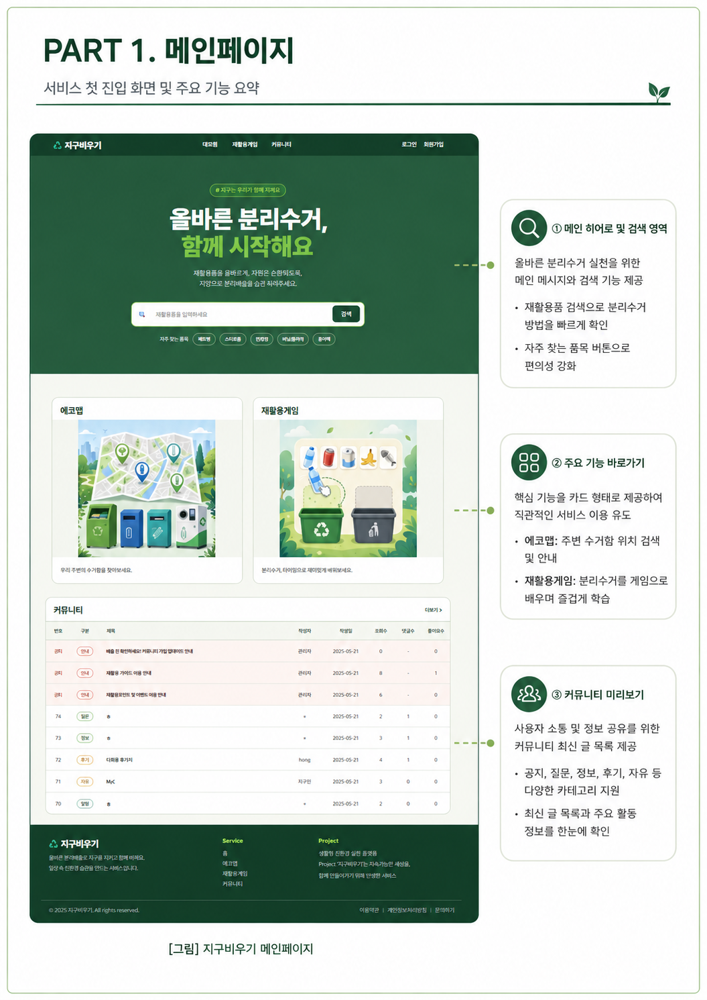
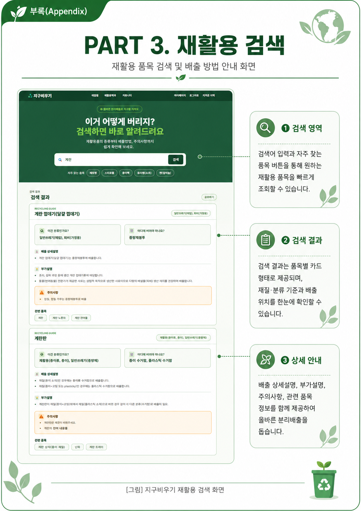
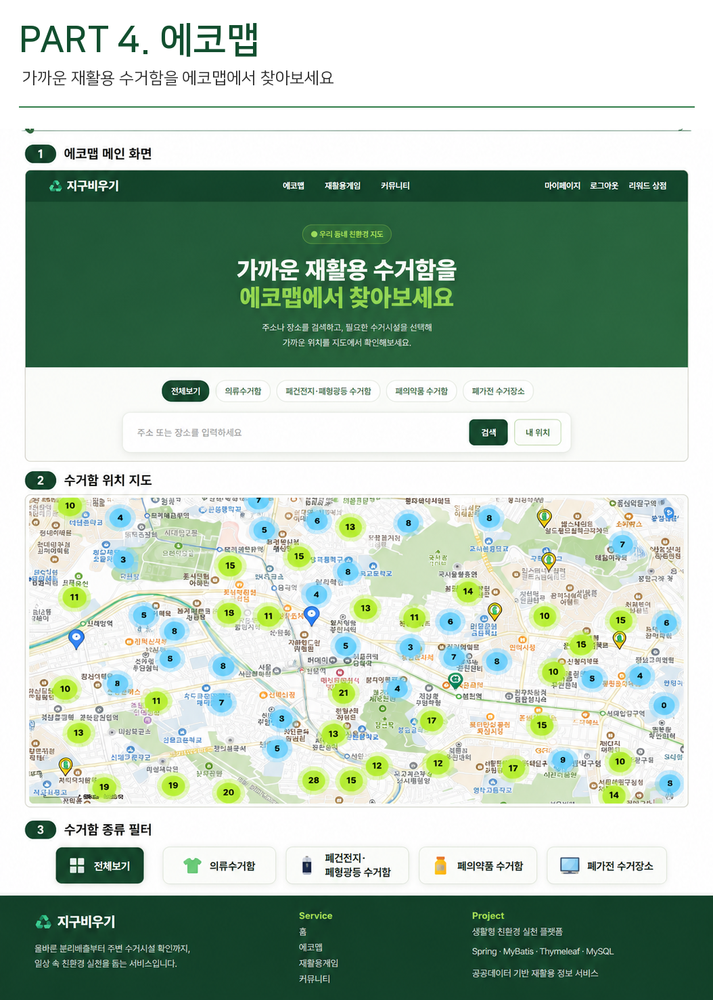
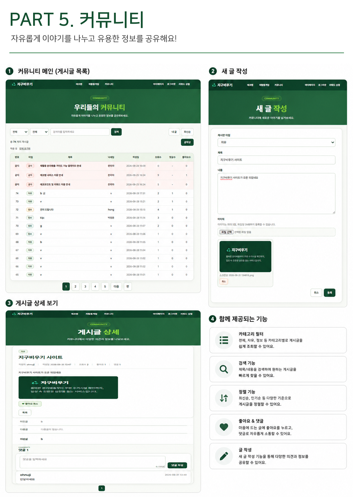
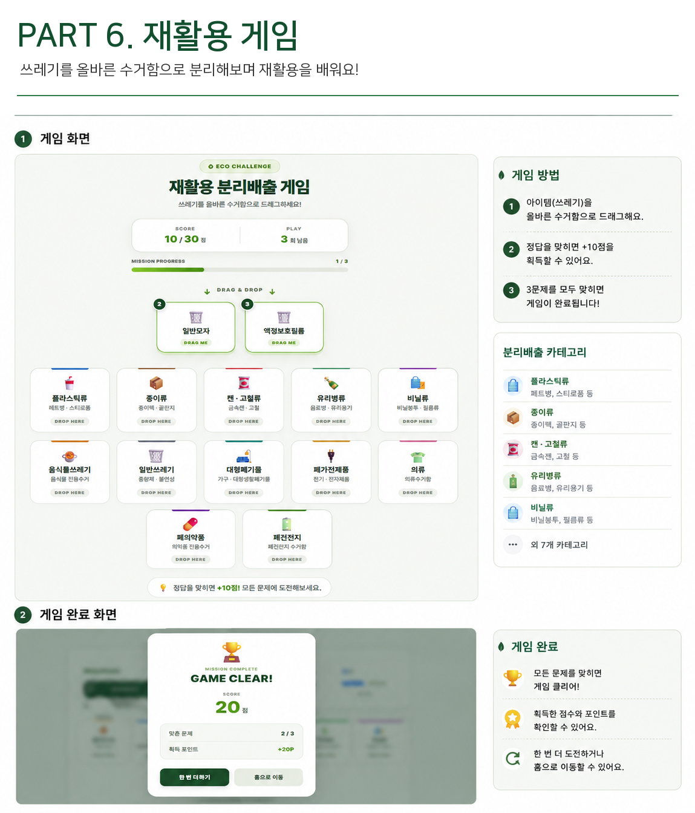
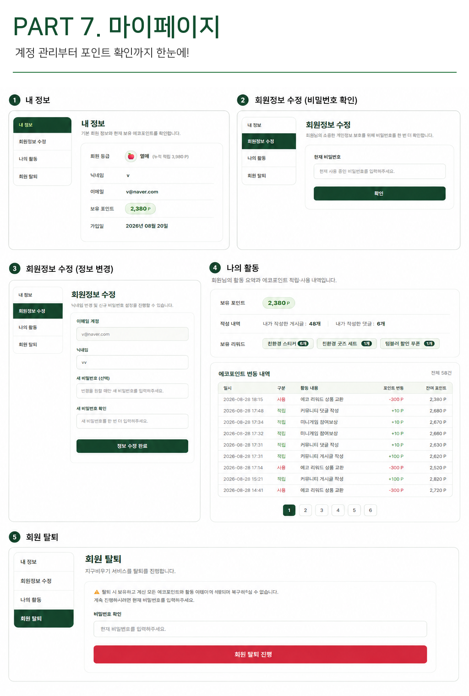

<div align="center">

# ♻️ 지구비우기

### 재활용 정보를 넘어, 친환경 행동까지 연결하는 생활형 친환경 플랫폼

재활용 정보 조회 · 에코맵 · 커뮤니티 · 에코포인트 · 리워드 · 재활용 미니게임

<br>


</div>

---

## 🌱 About

**지구비우기**는 재활용 정보를 단순히 조회하는 것에서 끝나지 않고,
사용자의 친환경 활동을 **포인트 · 등급 · 리워드 · 게임**과 연결한 웹 서비스입니다.

<div align="center">

```text
회원가입
   ↓
재활용 정보 조회
   ↓
친환경 활동
   ↓
에코포인트 적립
   ↓
등급 / 뱃지 성장
   ↓
리워드 교환
```

</div>

---

## ✨ Key Features

<table>
<tr>
<td width="50%" valign="top">

### 🔎 재활용 정보 검색

* 재활용 품목 검색
* 재활용 분류 확인
* 배출 방법 안내
* 배출 시 주의사항 제공
* 공공데이터 기반 DB 조회

</td>
<td width="50%" valign="top">

### 🗺️ 에코맵

* Kakao Map API 활용
* 의류수거함 위치 제공
* 폐건전지 수거함 위치 제공
* 폐형광등 수거함 위치 제공
* 페트병 자판기 위치 제공
* 현재 지도 영역 기준 데이터 조회

</td>
</tr>

<tr>
<td width="50%" valign="top">

### 💬 커뮤니티

* 게시글 CRUD
* 댓글 CRUD
* 좋아요 / 조회수
* 검색 / 페이징
* 이미지 첨부
* 공지사항 / 자유게시판 / 건의게시판

</td>
<td width="50%" valign="top">

### 🌱 에코포인트

* 회원가입 포인트 적립
* 게시글 작성 포인트 적립
* 게임 참여 포인트 적립
* 리워드 교환 포인트 차감
* 포인트 원장 방식 이력 관리

</td>
</tr>

<tr>
<td width="50%" valign="top">

### 🎁 리워드

* 보유 포인트 조회
* 리워드 재고 확인
* 포인트 차감
* 교환 내역 관리
* `@Transactional` 기반 정합성 관리

</td>
<td width="50%" valign="top">

### 🎮 재활용 미니게임

* Drag & Drop 방식
* 랜덤 재활용 품목 출제
* 품목별 올바른 분리배출 분류
* 게임 결과 기록
* 에코포인트 시스템 연동

</td>
</tr>
</table>

---

## 🔐 Account & Security

* 일반 회원가입 / 로그인 / 로그아웃
* Kakao OAuth 로그인
* LOCAL / KAKAO 회원 구분
* BCrypt 비밀번호 암호화
* 이메일 / 닉네임 중복 검사
* 세션 기반 로그인 상태 관리
* Interceptor 기반 접근 제어
* OAuth `state` 검증
* DB 비밀번호 / API Key 환경변수 분리
* 회원정보 수정 / 비밀번호 변경 / 회원 탈퇴

---

## 🏅 Eco Level

<div align="center">

### 🌰 씨앗　→　🌱 새싹　→　🌳 나무　→　🍎 열매

누적 에코포인트에 따라 회원 등급이 성장하며,
활동 조건을 만족하면 별도의 뱃지를 획득할 수 있습니다.

</div>

---

## 📸 Screenshots

> 실제 프로젝트 화면 이미지를 아래 형식으로 추가

<table>
<tr>
<td align="center" width="50%">
<b>🏠 Main</b><br><br>

</td>

<td align="center" width="50%">
<b>🔎 Recycling Search</b><br><br>

</td>
</tr>

<tr>
<td align="center">
<b>🗺️ Eco Map</b><br><br>

</td>

<td align="center">
<b>💬 Community</b><br><br>

</td>
</tr>

<tr>
<td align="center">
<b>🎮 Recycling Game</b><br><br>

</td>
<td align="center">
<b>🌱 My Page</b><br><br>

</td>

</tr>
</table>

---

## 🛠 Tech Stack

### Back-End

<p>


</p>

### Front-End

<p>


</p>

### Database & API

<p>


</p>

### Collaboration & Tools

<p>


</p>

---

## 🏗 Architecture

```text
┌───────────────────────────────┐
│            Client             │
│      HTML / CSS / JS          │
└───────────────┬───────────────┘
                │
                ▼
┌───────────────────────────────┐
│         Controller            │
│          Spring MVC           │
└───────────────┬───────────────┘
                │
                ▼
┌───────────────────────────────┐
│           Service             │
│       Business Logic          │
└───────────────┬───────────────┘
                │
                ▼
┌───────────────────────────────┐
│      Repository / MyBatis     │
│         Mapper XML            │
└───────────────┬───────────────┘
                │
                ▼
┌───────────────────────────────┐
│            MySQL              │
└───────────────────────────────┘
```

---

## 📂 Project Structure

```text
src
└─ main
   ├─ java
   │  └─ first_project.recycle
   │     ├─ config
   │     ├─ controller
   │     ├─ domain
   │     ├─ dto
   │     ├─ exception
   │     ├─ interceptor
   │     ├─ repository
   │     └─ service
   │
   └─ resources
      ├─ mapper
      ├─ static
      │  ├─ css
      │  ├─ images
      │  └─ js
      │
      └─ templates
         ├─ admin
         ├─ board
         ├─ fragments
         └─ mypage
```

---

## 🗄 Database Design

주요 테이블

```text
MEMBER
│
├── BOARD ── COMMENT
│      ├── BOARD_IMAGE
│      └── BOARD_LIKE
│
├── ECO_POINT_HISTORY
├── MEMBER_BADGE ── BADGE
├── GAME_HISTORY
└── REWARD_EXCHANGE ── REWARD

RECYCLE_ITEM

ECO_LOCATION
```

### 설계 포인트

* `MEMBER.email` UNIQUE
* OAuth 회원 구분을 위한 `provider`, `provider_id`
* 게시글 이미지 별도 관리
* Eco Point History 기반 포인트 원장 관리
* `balance_after`를 통한 잔액 추적
* `reference_type`, `reference_id`를 통한 포인트 발생 원인 추적
* `condition_type`, `condition_value` 기반 뱃지 조건 관리
* `location_type` 기반 에코시설 유형 관리

---

## 🌱 Eco Point Flow

```text
활동 발생
   │
   ├── 회원가입
   ├── 게시글 작성
   └── 미니게임
   │
   ▼
현재 포인트 조회
   │
   ▼
ECO_POINT_HISTORY 기록
   │
   ├── point_amount
   ├── balance_after
   ├── point_type
   ├── reference_type
   └── reference_id
```

포인트를 단순 컬럼 하나로 관리하지 않고
**모든 적립 · 차감 내역을 원장 형태로 기록**하여 추적 가능하도록 설계했습니다.

---

## 🎁 Reward Transaction

```text
교환 요청
   ↓
회원 포인트 검증
   ↓
리워드 재고 검증
   ↓
재고 차감
   ↓
포인트 차감
   ↓
교환 내역 저장
```

포인트와 재고가 동시에 변경되므로 `@Transactional`을 적용해
처리 중 오류 발생 시 전체 작업이 Rollback 되도록 구성했습니다.

---

## 👨‍💻 Admin

<details>
<summary><b>관리자 기능 보기</b></summary>
<br>

* 관리자 대시보드
* 회원 현황 조회
* 게시글 현황 조회
* 공지사항 CRUD
* 건의사항 확인 처리
* 리워드 관리
* 리워드 교환 내역 관리

</details>

---

## 📑 Project Documents

<details>
<summary><b>프로젝트 산출물 보기</b></summary>
<br>

- [📋 프로젝트 계획서](./docs/jigubium_project_plan.pdf)
- [🔗 URL Mapping](./docs/images/url_mapping.pdf)
- [🎨 화면흐름도](./docs/images/screen_flow_diagram.png)
- [🗄️ ERD](./docs/images/ERD.png)
- [📐 Class Diagram](./docs/images/class_diagram.png)
- [🌐 인프라 토폴로지](./docs/images/topology.png)
- [📅 WBS](./docs/jigubium_wbs.xlsx)
- [📄 프로젝트 완료보고서](./docs/jigubium_final_report.pdf)

</details>

---

## 🚀 Deployment

애플리케이션 구현뿐만 아니라
실제 서버 환경에서의 배포와 운영을 고려하여 프로젝트를 구성했습니다.

```text
Client
   │
   ▼
Network
   │
   ▼
Application Server
   │
   ▼
Spring Application
   │
   ▼
MySQL
```

> 상세 서버 및 네트워크 Topology는 프로젝트 발표자료에 포함되어 있습니다.

---

## 👥 Team

|    Name    |   Role    | 담당                                                           |
|:----------:|:---------:|----------------------------------------------------------------|
| `[장준호]` | `[팀장]`  | `[설계,재활용검색,포인트,리워드,관리자,개발고도화,보고서작성]` |
| `[박정훈]` | `[팀원]`  | `[에코맵,Git환경,DB컨테이너,메일서버,보고서작성]`              |
| `[김민기]` | `[팀원]`  | `[마이페이지,시연영상,NFS,DNS,FTP,본사Web,DB]`                 |
| `[박진혁]` | `[팀원]`  | `[로그인/회원가입,소셜로그인API,미니게임,DHCP]`                |
| `[강병관]` | `[팀원]`  | `[커뮤니티CRUD,이미지업로드,Web컨테이너,로드밸런싱]`           |

---

## 🎥 Demo

<div align="center">

### ▶ 프로젝트 시연 영상

[🎬 시연 영상 보기](./jigubium_demo.mp4)

</div>
---

## 💡 What We Learned

* Spring MVC 기반 계층형 구조 설계
* MyBatis 기반 SQL 및 데이터 처리
* Session / Interceptor 기반 인증 및 접근 제어
* Kakao OAuth 로그인 구현
* 공공데이터 수집 및 DB 적재
* Kakao Map API 활용
* Transaction 기반 데이터 정합성 처리
* Git / GitHub 기반 협업 및 Merge
* 환경변수를 활용한 민감정보 분리
* 실제 서버 환경을 고려한 배포 및 운영 설정

---

<div align="center">

<br>

## ♻️ 지구비우기

**작은 실천이 모여 지구를 바꿉니다. 🌱**

<br>

</div>
</div>
